  <picture>
    <source media="(max-width: 760px) and (prefers-color-scheme: dark)" srcset="./assets/hero/agent-console-eb6b22a6-mobile-dark.svg">
    <source media="(max-width: 760px)" srcset="./assets/hero/agent-console-eb6b22a6-mobile-light.svg">
    <source media="(prefers-color-scheme: dark)" srcset="./assets/hero/agent-console-eb6b22a6-dark.svg">
    <source media="(prefers-color-scheme: light)" srcset="./assets/hero/agent-console-eb6b22a6-light.svg">
    
  </picture>

  

  
  
  

  
  
  
  
  

---

Hey, <b>I'm Reyvien Axelliano — also known as xelisme.</b> I'm a cybersecurity student and CTF player competing in Crypto, Web, Forensic, OS Hardening, and Boot2Root. I build exploit and scanning tooling, write CTF writeups, and share networking tutorials. I believe every system has a story, and I learn mine by breaking things down with precision and curiosity. Right now I'm training for LKSN, Indonesia's national skills competition, while building toward a career as a pentester and security researcher.

> To become a security researcher who doesn't just run tools — but understands exactly why they work.

---

  

  

## 🔥 Featured Projects

  
  
  
  
  
  

  <table style="border-collapse: collapse; margin: 20px auto;">
    <tr>
 

  <!-- GIF KIRI -->
  <td style="padding: 15px; border: 1px solid #22D3EE;">
    
  </td>

  <!-- SOCIAL LINKS KANAN -->
  <td style="padding: 15px; border: 1px solid #22D3EE;">
    <table style="border-collapse: collapse;">
      <tr>
        <td style="padding: 8px;">
          
        </td>
        <td style="padding: 8px;">
          
        </td>
      </tr>
      <tr>
        <td style="padding: 8px;">
          
        </td>
        <td style="padding: 8px;">
          
        </td>
      </tr>
    </table>
  </td>

</tr>

  </table>

  

---

## 📊 GitHub Analytics

  

---

  

